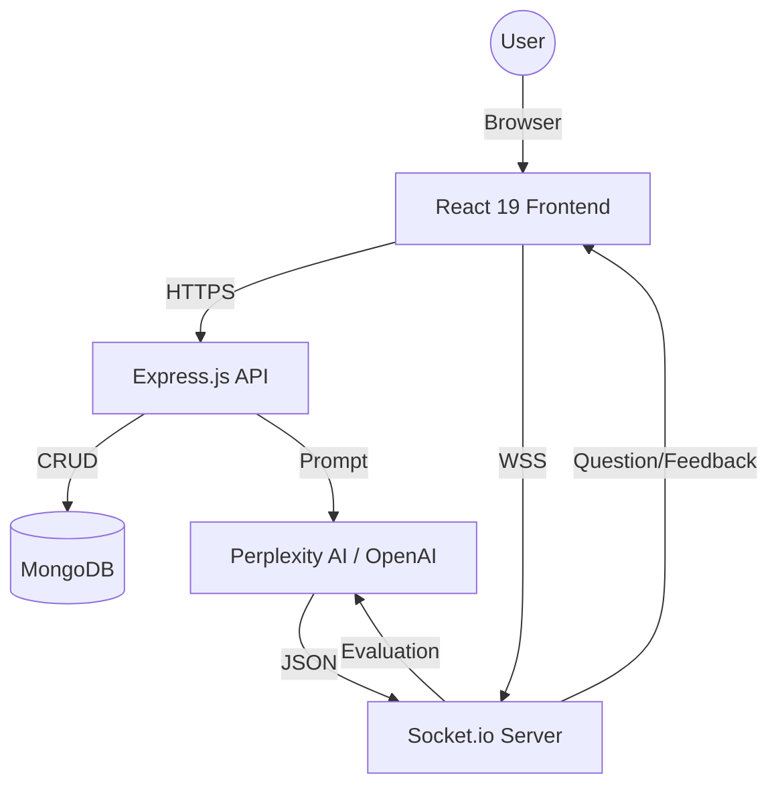

# Interview-AI: AI-Powered Technical Interview Platform

Interview-AI is a sophisticated platform designed to help candidates master technical interviews through interactive sessions with an adaptive AI. It provides real-time feedback, behavioral insights, and technical evaluations tailored to the candidate's background.

## 🚀 Features

-   **Adaptive AI Questioning**: Questions evolve based on your real-time performance to keep you in the optimal challenge zone.
-   **Resume-Tailored Sessions**: Upload your resume to receive questions specifically targeting your experience and indicated skills.
-   **HttpOnly Cookie Authentication**: Secure session management designed to prevent XSS and CSRF attacks.
-   **Comprehensive Analytics**: Detailed technical summaries with hiring verdicts (Hire/Reject/Borderline), highlighting strengths and weaknesses.
-   **Real-time Interaction**: Low-latency communication via WebSockets for a smooth interview flow.

## 🏗️ System Architecture



## 🛠️ Tech Stack

-   **Frontend**: React 19, Vite, Tailwind CSS 4, Radix UI, Lucide Icons, Recharts.
-   **Backend**: Node.js, Express, Socket.io, Mongoose.
-   **AI Integration**: Perplexity API (Sonar models), OpenAI SDK.
-   **Security**: Helmet, Express Rate Limit, HttpOnly JWT Cookies.
-   **Logging**: Winston (Structured JSON logging).

## ⚙️ Setup & Installation

### Prerequisites
-   Node.js (v18+)
-   MongoDB (Local or Atlas)
-   Perplexity AI API Key

### Backend Setup
1.  Navigate to `/backend`.
2.  Install dependencies: `npm install`.
3.  Create a `.env` file from `.env.example` (if provided) and add:
    ```env
    PORT=5000
    MONGO_URL=your_mongodb_url
    AI_API_KEY=your_perplexity_api_key
    JWT_SECRET=your_jwt_secret
    FRONTEND_URL=http://localhost:5173
    NODE_ENV=development
    ```
4.  Start the server: `npm start` or `npm run dev`.

### Frontend Setup
1.  Navigate to `/frontend-2`.
2.  Install dependencies: `npm install`.
3.  Create a `.env` file:
    ```env
    VITE_BACKEND_URL=http://localhost:5000
    ```
4.  Launch the development server: `npm run dev`.

---

## 🔒 Security Implementation

-   **JWT Cookies**: Authentication tokens are stored in `HttpOnly` and `Secure` cookies, making them inaccessible to client-side scripts.
-   **Rate Limiting**: API endpoints are protected against brute-force attacks via `express-rate-limit`.
-   **Security Headers**: `helmet` is used to set various HTTP headers for better security.

## 📊 AI Evaluation Logic

The platform uses a two-stage AI process:
1.  **Iterative Evaluation**: Each answer is evaluated individually for correctness and depth.
2.  **Detailed Summary**: At the end of the session, the AI reviews the entire transcript to provide a human-like hiring manager evaluation and actionable feedback.
